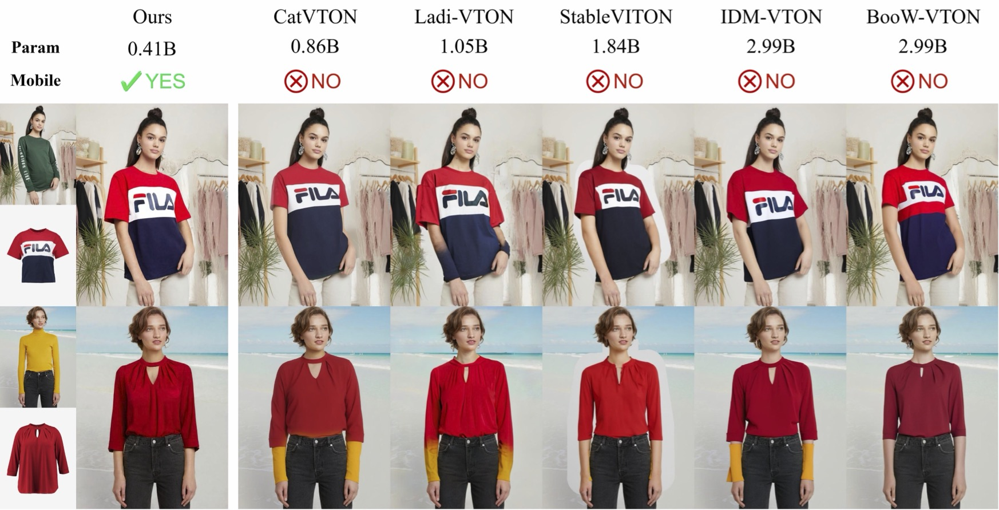

<div align="center">
<h1>\textsc{Mobile-VTON}: High-Fidelity On-Device Virtual Try-On</h1>

<a href='https://zhenchenwan.github.io/Mobile-VTON/'></a>
<a href='https://arxiv.org/abs/2603.00947'></a>
<!-- <a href=''></a> -->


</div>

This is the official implementation of the paper ["Mobile-VTON: High-Fidelity On-Device Virtual Try-On"](https://arxiv.org/abs/2603.00947).

Star ⭐ us if you like it!


---


&nbsp;


## Requirements

```
git clone https://github.com/tmllab/2026_CVPR_Mobile-VTON.git
cd 2026_CVPR_Mobile-VTON

conda env create -f environment.yaml
conda activate mobile
```


## Data preparation

### VITON-HD
You can download VITON-HD dataset from [VITON-HD](https://github.com/shadow2496/VITON-HD).

<!-- After download VITON-HD dataset, move vitonhd_test_tagged.json into the test folder, and move vitonhd_train_tagged.json into the train folder. -->

Structure of the Dataset directory should be as follows.

```

train
|-- image
|-- image-densepose
|-- agnostic-mask
|-- cloth

test
|-- image
|-- image-densepose
|-- agnostic-mask
|-- cloth

```

### DressCode
You can download DressCode dataset from [DressCode](https://github.com/aimagelab/dress-code).

IDM-VTON provide pre-computed densepose images and captions for garments [here](https://kaistackr-my.sharepoint.com/:u:/g/personal/cpis7_kaist_ac_kr/EaIPRG-aiRRIopz9i002FOwBDa-0-BHUKVZ7Ia5yAVVG3A?e=YxkAip).

After download the DressCode dataset, place image-densepose directories and caption text files as follows.

```
DressCode
|-- upper_body
    |-- images
    |-- image-densepose
    |-- image_descriptions.txt
    |-- ...
```


## Inference

VITON-HD and DressCode inference scripts are shown in the inference.sh

## Acknowledgements


Thanks [IP-Adapter](https://github.com/tencent-ailab/IP-Adapter) for base codes.

Thanks [IDM-VTON](https://github.com/yisol/IDM-VTON.git) for densepose of DressCode dataset.

## Star History

[](https://www.star-history.com/?repos=2026_CVPR_Mobile-VTON%2F2026_CVPR_Mobile-VTON&type=date&legend=top-left)

## Citation
```
@misc{wan2026textscmobilevtonhighfidelityondevicevirtual,
      title={\textsc{Mobile-VTON}: High-Fidelity On-Device Virtual Try-On}, 
      author={Zhenchen Wan and Ce Chen and Runqi Lin and Jiaxin Huang and Tianxi Chen and Yanwu Xu and Tongliang Liu and Mingming Gong},
      year={2026},
      eprint={2603.00947},
      archivePrefix={arXiv},
      primaryClass={cs.CV},
      url={https://arxiv.org/abs/2603.00947}
}
```


## License
The codes and checkpoints in this repository are under the [CC BY-NC-SA 4.0 license](https://creativecommons.org/licenses/by-nc-sa/4.0/legalcode).